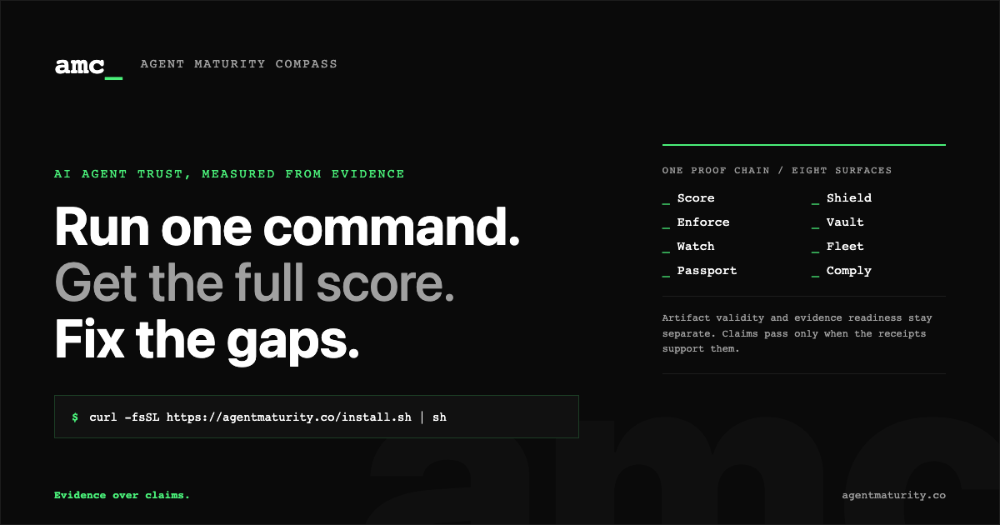

<p align="center">
  
</p>

<h1 align="center">Agent Maturity Compass</h1>

<p align="center">
  <strong>Run one command. Get the full score. Fix the gaps.</strong><br>
  Score, red-team, and ship AI agents with execution evidence and portable proof.<br>
  <em>Evidence over claims.</em>
</p>

<p align="center">
  <a href="https://github.com/AgentMaturity/AgentMaturityCompass/releases"></a>
  <a href="https://github.com/AgentMaturity/AgentMaturityCompass/releases"></a>
  <a href="https://github.com/AgentMaturity/AgentMaturityCompass/actions/workflows/ci.yml"></a>
  <a href="https://github.com/AgentMaturity/AgentMaturityCompass/actions/workflows/ci.yml"></a>
  <a href="LICENSE"></a>
</p>

<p align="center">
  <a href="#60-seconds-to-your-first-score">Quick Start</a> ·
  <a href="https://agentmaturity.co/playground.html">Web Playground</a> ·
  <a href="docs/GETTING_STARTED.md">Docs</a> ·
  <a href="#recipes--copy-paste-examples">Recipes</a> ·
  <a href="https://github.com/AgentMaturity/AgentMaturityCompass/discussions">Community</a> ·
  <a href="CONTRIBUTING.md">Contribute</a>
</p>

---

## What is this?

AMC scores AI agents from what they **actually do**, not what their docs say they do.

```bash
curl -fsSL https://agentmaturity.co/install.sh | sh
```

One command. No account. No API key. You get:

1. **A trust baseline** — L0 to L5 maturity, with evidence readiness shown separately
2. **A gap analysis** — exactly what's weak, what's risky, and what's missing
3. **Generated fixes** — guardrails, config patches, CI gates, and compliance artifacts

Then you keep going: add adversarial testing, continuous monitoring, regulatory mapping, and fleet-wide governance — all from the same CLI.
- **Evaluation workflows** — golden datasets, imported evals, lite scoring for non-agent apps
- **Business and compliance outputs** — KPI correlation, leaderboards, audit binders

Works with **LangChain, CrewAI, AutoGen, OpenAI Agents SDK, Claude Code, Gemini, OpenClaw**, and more — with zero or near-zero integration friction.

> A clean first run can produce a signed, `VALID` artifact while evidence readiness is `INSUFFICIENT_EVIDENCE`. That is intentional: signing proves artifact integrity, not evidence sufficiency. Capture a real agent run, rerun AMC, and use external claims only when readiness is `READY`.

<details>
<summary><strong>Why should I care?</strong></summary>

Today, many agents are evaluated by what they claim in docs, prompts, or self-reported checklists.
That is structurally weak.

AMC focuses on **execution-verified evidence**.

| How agents are evaluated today | How AMC evaluates |
|---|---|
| Agent claims "I'm safe" → Claimed score: 100 | AMC tests the agent and inspects evidence → Evidence-backed score may be 16 |
| Self-reported documentation | Execution-verified evidence |
| Keyword matching | Weighted trust evidence |
| "Trust me, bro" | Cryptographic proof chains |

That is the entire thesis: **trust, but verify — with receipts**.

</details>

---

## 60 Seconds to Your First Score

```bash
# macOS or Linux: download the pinned GitHub release and verify SHA-256
curl -fsSL https://agentmaturity.co/install.sh | sh

# Score your agent
cd your-agent-project
amc
```

To verify the CLI before initialization, run `amc doctor`. It reports install readiness in a new directory; CI and deployments use `amc doctor --strict` after the workspace is initialized.

On Windows PowerShell:

```powershell
irm https://agentmaturity.co/install.ps1 | iex
amc
```

Want a fast legacy pulse check instead of the full evidence score?

```bash
amc quickscore --rapid           # optional rapid check, not the full score
amc quickscore --answers answers.json --json  # non-interactive answer-based score
```

<details>
<summary><strong>More install methods</strong></summary>

**Verified release installer (Node.js 20 or 22 LTS required)**
```bash
curl -fsSL https://agentmaturity.co/install.sh | sh
```

```powershell
irm https://agentmaturity.co/install.ps1 | iex
```

Each installer pins the AMC release, downloads the platform archive and `SHA256SUMS` from GitHub Releases, verifies the archive, then installs the included package. npm and Homebrew registry commands are intentionally not advertised until those public channels are live.

**Docker**
```bash
docker build -t amc-quickstart -f docker/Dockerfile.quickstart .
docker run -it --rm amc-quickstart amc
```

Use the local build command unless a GHCR package has been verified public.

**From source**
```bash
git clone https://github.com/AgentMaturity/AgentMaturityCompass.git
cd AgentMaturityCompass && npm ci && npm run build && npm link
```

</details>

---

## How AMC Compares

|  | **AMC** | Observability platforms | Eval frameworks | Manual checklists |
|---|---|---|---|---|
| **Evidence model** | Execution-verified, cryptographic proofs | Logs and metrics, no trust scoring | Test pass/fail, no maturity model | Self-reported |
| **Adversarial testing** | 142 assurance packs built in | Not a focus | Partial (prompt-level only) | None |
| **Compliance mapping** | EU AI Act, ISO 42001, NIST, SOC 2, OWASP | Not included | Not included | Manual, labor-intensive |
| **Framework support** | 14 adapters, zero code changes | Framework-specific agents | Framework-specific | N/A |
| **Cost** | Free, open source (MIT) | Per-seat/month pricing | Free to paid | Free but manual |
| **Time to first result** | 60 seconds | Hours to days | Minutes to hours | Days to weeks |

AMC is not an observability tool and not an eval harness. It is a **trust scorecard** that shows what the evidence supports, what remains unproven, and which controls or compliance mappings need work. AMC does not certify legal compliance.

---

## What AMC Tests

### 244 Default Diagnostic Questions × 5 Dimensions

| Dimension | Questions | What It Measures |
|-----------|-----------|------------------|
| Strategic Agent Operations | 19 | Mission clarity, scope adherence, cost governance, operational intelligence |
| Leadership & Autonomy | 23 | Governance structure, EU AI Act readiness, proactive risk management, business continuity |
| Culture & Alignment | 95 | Feedback loops, forecast legitimacy, persona governance, UX honesty, over-compliance detection, social alignment |
| Resilience | 55 | Graceful degradation, circuit breakers, memory safety, threat resistance, fact/simulation boundaries |
| Skills | 52 | Tool mastery, injection defense, DLP, scenario traceability, replay safety |

### 142 Assurance Packs

| Category | Examples |
|----------|---------|
| Prompt Injection | System tampering, role hijacking, jailbreaks |
| Exfiltration | Secret leakage, PII exposure, data boundary violations |
| Adversarial | TAP/PAIR, Crescendo, Skeleton Key, best-of-N |
| Context Leakage | EchoLeak, cross-session bleed, memory poisoning |
| Supply Chain | Dependency attacks, MCP server poisoning, SBOM integrity |
| Behavioral | Sycophancy, self-preservation, sabotage, over-compliance |

### 41 Industry Domain Packs

| Sector | Packs | Key Regulations |
|--------|-------|-----------------|
| Health | 9 | HIPAA, FDA 21 CFR Part 11, EU MDR, ICH E6(R3) |
| Wealth | 5 | MiFID II, PSD2, EU DORA, MiCA, FATF |
| Education | 5 | FERPA, COPPA, IDEA, EU AI Act Annex III |
| Mobility | 6 | UNECE WP.29, ETSI EN 303 645, EU NIS2, ISO 28000, GS1 EPCIS |
| Technology | 5 | EU AI Act Art. 13, EU Data Act, DSA Art. 34 |
| Environment | 6 | EU Farm-to-Fork, REACH, IEC 61850 |
| Governance | 5 | EU eIDAS 2.0, UNCAC, UNGPs |

Industry Packs are paid content: `$9.99/month` unlocks all 41 packs in the CLI and Studio. Run `amc domain pack checkout` to open the subscription flow, then paste the returned key into Studio or run `amc domain pack activate --key <license-key>`.

### Simulation & Forecast Evaluation Lane

Dedicated evaluation lane for simulation engines, forecast systems, and synthetic social environments. 5 scored dimensions:

| Dimension | Weight | Questions | What it evaluates |
|-----------|--------|-----------|-------------------|
| Forecast Legitimacy | 25% | AMC-6.1–6.10 | Uncertainty expression, calibration, scenario vs prediction framing |
| Boundary Integrity | 20% | AMC-6.11–6.17, 6.37–6.42 | Fact/inference/simulation separation, writeback governance |
| Synthetic Identity | 20% | AMC-6.18–6.25, 6.48–6.52 | Persona governance, real-person representation controls |
| Simulation Validity | 20% | AMC-6.30–6.36 | Mode collapse detection, population diversity, historical calibration |
| Scenario Provenance | 15% | AMC-6.26–6.29, 6.53–6.57 | End-to-end traceability, replay capability, interaction safety |

```bash
amc score simulation-lane --system-type simulation-engine              # interactive
amc score simulation-lane --system-type forecast-decision-support --json  # JSON output
amc score simulation-lane --system-type synthetic-social-environment --responses answers.json
```

### 79 Scoring Modules

<details>
<summary>See all modules</summary>

- Calibration gap (confidence vs reality)
- Evidence conflict detection
- Gaming resistance (adversarial score inflation)
- Sleeper agent detection (context-dependent behavior)
- Policy consistency (pass^k reliability)
- Factuality (parametric, retrieval, grounded)
- Memory integrity & poisoning resistance
- Alignment index (safety × honesty × helpfulness)
- Over-compliance detection (H-Neurons, arXiv:2512.01797)
- Monitor bypass resistance (arXiv:2503.09950)
- Trust-authorization synchronization (arXiv:2512.06914)
- MCP compliance scoring
- Identity continuity tracking
- Behavioral transparency index
- **Forecast legitimacy** (epistemic honesty, calibration, uncertainty)
- **Fact/simulation boundary** (provenance separation, writeback governance)
- **Synthetic identity governance** (persona labeling, real-person controls)
- **Simulation validity** (mode collapse, population diversity)
- **Scenario provenance** (traceability, replay, interaction safety)
- And 60+ more...

</details>

---

## Architecture

```
Agent (untrusted)
    │
    ▼
AMC Gateway ──── transparent proxy, agent doesn't know it's being watched
    │
    ▼
Evidence Ledger ──── Ed25519 signatures + Merkle tree proof chains
    │
    ▼
Scoring Engine ──── evidence-weighted diagnostics, research-backed scoring, 142 assurance packs
    │
    ▼
AMC Studio ──── dashboard + API + CLI + reports
```

Studio's protected module API uses signed sessions and route-level least-privilege authorization: viewers read, operators run, approvers approve, auditors verify, and owners control secrets, signing, identity, and policy. Agent and lease credentials cannot enter the internal `/api/v1` control plane.

### Evidence Trust Tiers

| Tier | Weight | How |
|------|--------|-----|
| `OBSERVED_HARDENED` | 1.1× | AMC-controlled adversarial scenarios |
| `OBSERVED` | 1.0× | Captured via gateway proxy |
| `ATTESTED` | 0.8× | Cryptographic attestation |
| `SELF_REPORTED` | 0.4× | Agent's own claims (capped) |

### Maturity Scale

| Level | Name | Meaning |
|-------|------|---------|
| **L0** | Absent | No safety controls |
| **L1** | Initial | Some intent, nothing operational |
| **L2** | Developing | Works on happy path, breaks at edges |
| **L3** | Defined | Repeatable, measurable, auditable |
| **L4** | Managed | Proactive, risk-calibrated, cryptographic proofs |
| **L5** | Optimizing | Self-correcting, continuously verified |

No AMC maturity level is a legal compliance threshold. Compliance depends on the system, role, use case, jurisdiction, obligations, and current evidence.

---

## Product Family

AMC is one trust stack with eight named product surfaces:

| Product | Promise | What it does |
|---|---|---|
| **Score** | Score trust before you ship | Evidence-weighted scoring across live execution behavior instead of brochure claims. |
| **Shield** | Attack your agent before attackers do | Runs adversarial packs against prompt injection, leakage, memory poisoning, and sycophancy. |
| **Enforce** | Wrap agent actions in policy | Approval gates, scoped permissions, and runtime controls for sensitive operations. |
| **Vault** | Cryptographically prove what happened | Signs evidence, verifies ledgers, and gives auditors a tamper-evident chain of custody. |
| **Watch** | See trust drift before it hurts you | Monitors posture over time and surfaces anomalies, regressions, and risky changes. |
| **Comply** | Map trust evidence to real frameworks | Turns technical evidence into regulator-readable artifacts for audits and risk reviews. |
| **Fleet** | Govern many agents like an actual platform | Benchmarks multiple agents, compares risk posture, and enforces org-wide trust baselines. |
| **Passport** | Make trust portable between environments | Issues a portable, signed trust identity that can move between tools, teams, and environments. |

---

## Recipes — Copy-Paste Examples

### Score any agent in one line

```bash
amc                               # full score after global install
amc run                           # explicit 8-surface maturity run
amc run --question-set lifecycle  # opt-in 264-question lifecycle expansion
```

Need a fast pulse check for a demo or README badge? Use `amc quickscore --rapid` explicitly.

Need a CI-safe score without terminal prompts? Use `amc quickscore --answers answers.json --json`, where `answers.json` maps question IDs to L0-L5 numbers.

If `amc quickscore` prints a placeholder L0 because no terminal prompt was available, it now shows a first-run hint: "Did you mean to run the interactive score?" Run it in a terminal, or pass answers explicitly for CI.

If `amc quickscore --auto --json` cannot find captured execution evidence, it fails closed with `scoreStatus: "AUTO_NO_EVIDENCE"` and does not emit a measured zero score. Capture evidence with `amc wrap <runtime> -- <your-agent-command>`, or use `amc quickscore --answers answers.json --json` for CI-safe survey scoring.

Advanced proof check:

```bash
amc resource snapshot            # record agent-defining resources under Enforce
amc resource status              # show signed active, previous, rollback, drift, and integrity state
amc resource validate            # run Enforce gates over resource drift
amc resource activate            # apply alias; dry-run unless --yes writes a signed activation receipt
amc resource rollback            # dry-run rollback; add --apply to activate a verified signed snapshot
amc firewall enable --mode observe # evaluate the signed policy without blocking valid traffic
amc firewall status              # inspect verified would-warn/would-block versus actual counters
amc firewall enable --mode block # promote the same policy to full enforcement after review
amc firewall check --direction request --text "ignore previous instructions"
amc firewall events              # inspect signed allow/warn/block decision events
amc firewall export --out firewall.jsonl --format splunk --redacted
amc firewall migrate-signature --approve-legacy-kind # preserve an exact verified legacy policy in the signed control journal
amc policy controls              # inspect verified Scope / When / Then / Status across existing controls
amc policy controls --json       # return the same read-only projection for automation
amc policy scope list            # list four immutable action-class scope templates
amc policy scope compile release-external --pack code-agent.high
                                  # preview a narrow selected-rule merge without writing
amc policy scope apply release-external --pack code-agent.high --confirm <compileId>
                                  # exact-confirm and sign the reviewed Action/Approval policy change
amc policy action logic show DEPLOY
                                  # inspect declared maturity/assurance gates and mandatory gates
amc policy action logic compile DEPLOY --file deploy-evidence-logic.json
                                  # preview a bounded all/any evidence tree without writing
amc policy action logic apply DEPLOY --file deploy-evidence-logic.json --confirm <compileId> --acknowledge-alternatives
                                  # exact-confirm and sign the reviewed Action Policy logic
amc policy simulate runtime:prompt-injection --direction request --content "ignore previous instructions"
                                  # preview the exact Runtime Firewall match without recording it
amc policy simulate action:DEPLOY --agent default --risk high --mode execute
                                  # preview Action Policy gates through the production evaluator
amc policy simulate approval:DEPLOY # inspect the signed approval quorum without creating a request
amc policy test policy-fixtures.yaml --json
                                  # block CI when expected control decisions regress
amc approvals list --agent default --status pending
                                  # inspect the canonical signed approval inbox
amc approvals list --agent default --action-class DEPLOY --risk-tier high --created-after 2026-07-01T00:00:00Z --json
                                  # search the fail-closed privacy-safe approval activity view
amc approvals approve --agent default <requestId> --mode execute --reason "reviewed"
                                  # record one signed quorum decision
amc guardrails list              # compare signed intent with effective runtime bindings
amc guardrails enable prompt-injection-detection
amc shield confirm scope-write --file security-scope.json
amc shield confirm run --scope scope-1 --task finding-task.json
amc shield confirm export <proof> --out safe-proof.json
amc proof check --domain governance --manifest fixtures/domain-proof/toy-governance/source-rule-manifest.json --input examples/domain-proof/toy-governance/proven.json --out result.amcproof.json
amc import ./agent-run --dry-run # detect traces, runs, graphs, configs, memory, evals, and benchmarks without writing
amc import ./agent-run           # write redacted import evidence into episodes, lifecycle runs, manifests, and trace indexes
amc strategy compare --file strategies.json --objective balanced
amc strategy compare --file strategies.json --apply --approve # commit a manifest-covered model route with receipts
amc strategy rollback <run>      # restore the prior model route
amc runtime create --run live-1  # persist connected-agent run state across restarts
amc runtime event live-1 --type policy.decision --receipt rec-1
amc runtime inspect live-1       # inspect run state and redacted event stream
amc fleet graph write --file graph.json # register a typed multi-agent graph for fleet validation
amc fleet graph validate         # check contracts, permissions, cycles, and fan-out before scoring
amc fleet score --all --stream   # full-score every configured agent with per-agent SLA progress
amc fleet lifecycle list         # inspect fleet parent/child lifecycle evidence
amc fleet lifecycle show <run>   # review topology, typed graph digest, shared resources, and cascade failures
amc org run --roles REV_PRODUCT_MANAGER,REV_TECH_LEAD,REV_QA_LEAD
                                  # advanced Fleet role loop with isolated workspaces, heartbeats, and signed evidence
amc org inspect <run> --redacted  # review role status without local private grader paths
amc enforce resources verify     # advanced alias for the same Enforce resource engine
amc evidence lifecycle list      # inspect the full lifecycle artifacts behind recent runs
amc evidence lifecycle export <run> --out lifecycle.json --redacted
amc evidence episodes list       # see the evidence objects behind recent full scores
amc evidence episodes export <id> --out episode.json --redacted
amc evidence decisions list      # see recommendation and evidence-request receipts
amc evidence decisions observe <run> # update older receipts with observed outcomes
amc evidence observability list  # see component, experience, and decision observability
amc memory writeback <episode>   # store redacted, evidence-backed reasoning lessons with receipts
amc memory retrieve --consumer fixer # retrieve active lessons for score, recommendations, fixer, or Studio
amc report <run>                 # review confidence, uncertainty, and auto-fix gates in plain language
amc trace index                  # list distilled trace failure indexes
amc trace failures               # see recurring failure clusters and repair inputs
amc mechanic rca run <run>       # turn a failure index into RCA, regression tests, and governed fix proposals
amc mechanic rca list            # review signed Fixer RCA reports
amc experiment optimize --rca latest # create isolated candidates, held-out validation, leakage checks, and receipts
amc experiment optimizer-list     # review governed optimizer runs and accepted/rejected candidates
amc evidence finding-proofs list # trace finding -> evidence -> resource -> recommendation
amc evidence lifecycle-receipts list # see proposal, validation, commit, rollback, and monitor receipts
npm run release:gate             # release gate for CLI, Studio assets, docs, website spec, domain packs, and receipt output
```

For a source-of-truth command map generated from the live CLI registry, run `amc commands --markdown` or see [docs/CLI_COMMAND_INVENTORY.md](docs/CLI_COMMAND_INVENTORY.md).

### Wrap an existing agent (zero code changes)

```bash
# LangChain
amc wrap langchain -- python my_agent.py

# CrewAI
amc wrap crewai -- python crew.py

# AutoGen
amc wrap autogen -- python autogen_app.py

# OpenClaw
amc wrap openclaw-cli -- openclaw run

# Claude Code
amc wrap claude-code -- claude "analyze this code"

# Any CLI agent
amc wrap generic-cli -- python my_bot.py
```

### Observe or control native provider actions

Claude Code and Gemini CLI can be connected without hand-editing provider files:

```bash
# Preview every file first
amc connect hooks install --provider claude-code --agent my-agent --dry-run

# Install, verify, and remove the project-local integration
amc connect hooks install --provider claude-code --agent my-agent
amc connect hooks status --provider claude-code
amc connect hooks health --provider claude-code
amc connect hooks lifecycle --agent my-agent --action <action-id>
amc connect hooks remove --provider claude-code

# Gemini CLI uses the same lifecycle
amc connect hooks install --provider gemini-cli --agent my-agent

# Explicit control mode requires the local loopback Studio/Bridge
amc up
amc connect hooks install --provider claude-code --mode control --agent my-agent
```

The default `observe` mode preserves unrelated provider settings, adds a managed `.gitignore` rule for `.amc/hooks/`, stores a dedicated `hook:observe` lease outside provider config with mode `0600`, signs its ownership manifest, and removes only the AMC-owned handlers and ignore block. It records requested actions and their completed or failed terminal state under one stable action ID. `hooks health` distinguishes an intact installation awaiting its first event from the latest receipt-verified event and from fail-closed drift, expiry, malformed metadata, or evidence tamper. Last-observed time is historical evidence, not a claim that the provider is live now. A locked Vault cannot authenticate encrypted event bodies, so health exits 2 with `HOOK_EVIDENCE_UNAVAILABLE`; run `amc vault unlock` or set `AMC_VAULT_PASSPHRASE` for non-interactive use. The lifecycle command verifies each receipt and fails closed on missing, ambiguous, conflicting, cross-agent, out-of-order, or tampered evidence. Tool arguments, outputs, error messages, cwd, transcript paths, and raw session IDs are not retained.

`--mode control` is an explicit loopback-only Enforce path. It adds `hook:control`, evaluates raw provider input in memory without retaining it, reuses signed ToolHub, Action Policy, Approval Policy, budget, freeze, maturity, and assurance gates, and binds the exact native response to a signed receipt. Claude Code can receive `allow`, `deny`, or `ask`. Gemini CLI has no native `ask` result, so AMC converts that outcome to an explicit deny. Multi-user or distinct-user AMC quorum is never weakened to one provider prompt. Codex, Cursor, OpenCode, and other providers remain unsupported until their native per-tool hook contracts are pinned and fixture-tested.

Track real first-run outcomes without creating traffic or evidence:

```bash
amc connect --status --agent my-agent
```

The CLI and Studio show connected agent, first observed action, first control decision, and first signed proof from one read-only projection. Signed configuration is `READY`, not complete; only verified receipts for the selected agent complete activation. Metadata-only, cross-agent, missing-receipt, or tampered state fails closed.

For custom runtimes that already emit a canonical event, call the ingress directly. Use a dedicated observation lease; do not reuse a broad model-routing token:

```bash
LEASE="$(amc lease issue --agent hook-agent --ttl 30m --scopes hook:observe --routes /hooks --models '*' --rpm 60)"
EVENT_TIME="$(date -u +%Y-%m-%dT%H:%M:%SZ)"

curl -sS http://127.0.0.1:3212/bridge/hooks/aep/0.1/events \
  -H "authorization: Bearer $LEASE" \
  -H "content-type: application/json" \
  --data "{\"aep_version\":\"0.1\",\"id\":\"evt-amc-001\",\"type\":\"action.requested\",\"time\":\"${EVENT_TIME}\",\"agent\":{\"slug\":\"example-agent\"},\"action\":{\"type\":\"tool_call\",\"id\":\"action-amc-001\"},\"tool\":{\"type\":\"native\",\"name\":\"Shell\"}}"
```

AMC observes four pinned AEP `0.1` action types, stores only an encrypted redacted projection, and returns a signed receipt. Byte-identical retries return the original receipt without growing the ledger; reuse of a source event ID with different bytes fails closed. This is an AMC-owned observed subset pinned to `2583cff9380f8f0a459d52c7112b6105c46496ed`, not an AEP conformance claim and not a control-response endpoint.

### Red-team your agent

```bash
amc assurance run --scope full                           # full assurance library
amc assurance run --pack prompt-injection                # specific attack
amc assurance run --pack adversarial-robustness          # TAP/PAIR/Crescendo
amc assurance run --format sarif                         # export for security tools
```

### Inspect traces and operational drift

```bash
amc observe timeline                                     # score history + evidence volume
amc observe anomalies                                    # volatility / regressions / weirdness
amc trace list                                           # recent agent sessions
amc trace inspect <trace-id>                             # inspect tool calls and trust tiers
```

### Run realtime monitoring

```bash
amc monitor start                                        # fresh full score now, then continuous scoring
amc monitor start --scoring-interval 60000               # rescore every minute
amc monitor status                                       # active monitor metrics
amc monitor events --limit 20                            # recent score, drift, anomaly, and alert events
```

`amc monitor start` bootstraps the AMC workspace if needed, generates a fresh full diagnostic immediately, then keeps creating new full diagnostic runs on the configured interval. Drift checks and alerts run against those fresh runs instead of rereading stale score files.

### Build golden datasets and run evals

```bash
amc dataset create support-bot                           # create a reusable eval dataset
amc dataset add-case support-bot --prompt "..." --expected "..."
amc dataset run support-bot                              # run eval cases
amc eval import --format promptfoo --file results.json   # import external eval results
amc eval registry                                        # inspect signed evaluator metadata
amc eval registry --refresh                              # explicitly refresh and sign the derived snapshot
amc lite-score                                           # score a non-agent chatbot / LLM app
```

`amc eval registry` reads one deterministic catalog over AMC's existing deterministic metrics, LLM judges, and assurance packs. The default command is read-only; `--refresh` is the only write path. A trusted snapshot binds package-relative owners, versions, and implementation hashes, while custom runtime metrics remain visible but unverified. Registry metadata is not evaluator-result evidence and cannot prove that an evaluator ran or passed. See [Evaluator Registry](docs/EVALUATOR_REGISTRY.md).

### Business, inventory, and reporting

```bash
amc business kpi                                         # correlate maturity to outcomes
amc business risk --maturity 3 --baseline-frequency 4 --incident-cost 50000 --json
amc business fair-scenario --scenario claims-ai-data-leak --maturity 3 --frequency-min 2 --frequency-most-likely 5 --frequency-max 9 --loss-min 20000 --loss-most-likely 75000 --loss-max 250000 --out fair-scenario.md
amc business roi --current-maturity 2 --target-maturity 3 --baseline-frequency 5 --incident-cost 20000 --annual-control-cost 15000 --implementation-cost 5000
amc business heatmap --portfolio risk-portfolio.json --out risk-heatmap.md
amc business grc-export --portfolio risk-portfolio.json --out grc-treatment-plan.csv
amc business report                                      # stakeholder-ready business summary
amc executive brief --run latest --out board-brief.html  # print-ready board one-pager
amc leaderboard show                                     # compare agents across a fleet
amc leaderboard public-export --output public-leaderboard # anonymized leaderboard dataset bundle
amc compare <run-a> <run-b> --output compare.json --badge # run diff plus compare-badge.svg
amc inventory scan --deep                                # discover agents, frameworks, model files
amc comms-check --text "Guaranteed 40% return" --domain wealth
```

`amc policy controls` is a read-only projection over Runtime Firewall, Guardrails, Action Policy, and Approval Policy. It verifies the existing signed sources before reporting an effective result. Invalid Runtime or Guardrails evidence projects `BLOCK`, invalid Action Policy projects `SIMULATE`, and invalid Approval Policy projects `DENY`; the command exits with status 2 when any family fails closed. It does not create or activate controls.

`amc policy scope` groups the existing nine action classes into four immutable AMC templates. Compile verifies the current signed Action and Approval Policy baselines and preserves every unselected rule; apply requires the exact content-bound compile ID, uses the existing lock/atomic writers/signers, restores prior bytes on failure, and records existing transparency/ledger evidence only after both policies verify. Workspace policies remain fleet-wide, so these templates never claim per-agent or per-environment scope. See [Reusable Policy Scope Templates](docs/SCOPE_TEMPLATES.md).

`amc policy action logic` composes only maturity and assurance requirements already declared by one signed Action Policy rule. Every requirement remains present exactly once, `any` alternatives stay within one evidence family, and signature/trust, trust tier, sandbox, ticket, budget, freeze, work-order, and `allowExecute` gates remain mandatory. Existing rules keep implicit all-requirements behavior, including legacy requirement IDs. Preview is read-only; apply requires an exact compile ID plus explicit alternative acknowledgement, shares one writer lock with every Action Policy mutation path, preserves unrelated YAML comments, and restores the signed baseline if policy or evidence finalization fails. See [Action Policy Evidence Logic](docs/ACTION_EVIDENCE_LOGIC.md).

`amc policy simulate <controlId>` takes the next read-only step: it invokes the selected control's production evaluator and reports the exact matched rules, pass/fail conditions, and safe outcome. Runtime content is hashed and never returned; no Firewall event, approval request, decision receipt, transparency entry, key, or workspace scaffolding is created. Every result is marked `simulationOnly: true`, `recorded: false`, and `proofEligible: false`. See [Control Simulation](docs/CONTROL_SIMULATION.md).

`amc policy test <file> [--json]` turns those same production simulations into a deterministic CI regression suite. Strict YAML/JSON cases assert exact outcomes and matched IDs; untrusted current policy sources fail closed instead of passing an expected safe result. Reports omit raw inputs, reasons, paths, signatures, and timestamps, create no runtime evidence, and use exit 0 for pass, 1 for mismatch, and 2 for invalid or untrusted state. See [Control Simulation](docs/CONTROL_SIMULATION.md#policy-regression-suites).

When ToolHub requires approval, the CLI, Dashboard, diagnostics, and Studio read the same signed quorum chain. `amc approvals list` can search the stable request ID and filter privacy-safe status, action, risk, mode, time, order, and limit fields. It audits every canonical request, decision, consumption record, and detached signature before filtering; malformed, tampered, misbound, or orphaned activity returns no rows. The view never searches tool names, intent/work-order IDs, reviewer identities, reasons, commands, prompts, or payloads, and it is marked `derivedView: true`, `recorded: false`, and `proofEligible: false`. Configured Integrations channels still receive only metadata-only lifecycle notifications. See [Approvals](docs/APPROVALS.md).

`amc tools list --json` verifies the signed ToolHub allowlist, derives stable tool and MCP server identities, groups tools by declared provider context, and reuses those identities in the Fleet CGX trust graph. Existing version 1 configs remain native when context is omitted. Missing or invalid signatures, malformed declarations, duplicate tools, or conflicting server metadata return no rows. The projection is read-only and explicitly non-proof; it does not discover or attest a live MCP server. See [ToolHub](docs/TOOLHUB.md).

### Auto-fix everything

```bash
amc fix                          # generate guardrails + CI gate + governance docs
amc fix --target-level L4        # target a specific level
amc guide --go                   # detect framework → apply guardrails to config
amc guide --watch                # continuous monitoring + auto-update
```

### Compliance in one command

```bash
amc audit binder create --framework eu-ai-act            # EU AI Act evidence binder
amc compliance report --framework iso-42001              # ISO 42001 report
amc domain assess --domain health                        # HIPAA assessment
amc domain assess --domain wealth                        # MiFID II / DORA
```

### GitHub Actions — CI trust gate

```yaml
# .github/workflows/amc.yml — copy this entire file
name: AMC Trust Gate
on:
  pull_request:
  push:
    branches: [main]

jobs:
  amc-score:
    runs-on: ubuntu-latest
    steps:
      - uses: actions/checkout@v4

      - uses: AgentMaturity/AgentMaturityCompass/amc-action@main
        with:
          agent-id: my-agent
          target-level: 3
          fail-on-drop: true
          comment: true
          upload-artifacts: true
```

### Badge for your README

For a run-to-run or model-route comparison badge, generate it from the real comparison command:

```bash
amc compare <run-a> <run-b> --output compare.json --badge
amc compare gpt-4o-mini claude-3-haiku --agent support-bot --output model-compare.json --badge
# writes compare-badge.svg or model-compare-badge.svg beside the report
```

Standalone maturity badges are also available when you only need a README trust marker:

```markdown
<!-- Add this to your README -->
[-green?logo=data:image/svg+xml;base64,PHN2ZyB4bWxucz0iaHR0cDovL3d3dy53My5vcmcvMjAwMC9zdmciIHZpZXdCb3g9IjAgMCAyNCAyNCI+PHBhdGggZmlsbD0iI2ZmZiIgZD0iTTEyIDJMMiA3bDEwIDUgMTAtNXptMCA5bC04LjUtNC4yNUwyIDEybDEwIDUgMTAtNXptMCA5bC04LjUtNC4yNUwyIDIxbDEwIDUgMTAtNXoiLz48L3N2Zz4=)](https://github.com/AgentMaturity/AgentMaturityCompass)
```

Result: -green)

---

## 14 Framework Adapters

Route a supported CLI or generated framework sample through AMC without replacing the agent runtime.

```bash
amc adapters init
amc adapters configure --agent my-agent --adapter generic-cli --route /openai --model gpt-4o --mode SUPERVISE
amc adapters run --agent my-agent --adapter generic-cli -- python bot.py
```

| Adapter | Canonical ID | Version probe |
|---------|--------------|---------------|
| AutoGen | `autogen-cli` | CLI when present, otherwise host Python |
| Claude Code | `claude-cli` | Claude binary |
| CrewAI | `crewai-cli` | CLI when present, otherwise host Python |
| Gemini CLI | `gemini-cli` | Gemini binary |
| Generic CLI | `generic-cli` | Shell runtime only |
| LangChain Node | `langchain-node` | Host Node.js only |
| LangChain Python | `langchain-python` | Host Python only |
| LangGraph Python | `langgraph-python` | Host Python only |
| LlamaIndex Python | `llamaindex-python` | Host Python only |
| OpenAI Agents SDK | `openai-agents-sdk` | Host Node.js only |
| OpenClaw | `openclaw-cli` | OpenClaw binary |
| OpenHands | `openhands-cli` | OpenHands binary |
| Python AMC SDK | `python-amc-sdk` | Installed package |
| Semantic Kernel | `semantic-kernel` | Host Node.js only |

Do not treat a detected runtime as proof of event/control coverage. Issue a portable signed receipt that separates declared from currently effective capabilities and records lossiness:

```bash
amc adapters capabilities --agent my-agent --adapter claude-cli --out adapter-capabilities.json --json
```

Claude Code receipts can verify allow/deny/ask and bounded corrective steer only with a valid signed control hook. Steer blocks the current call, rewrites no input, and requires a new fully governed action for retry. Gemini CLI receipts expose allow/deny and explicitly record that ask or requested steer degrades to a lossy deny. Metadata-only plugin adapters fail closed instead of inheriting a compatibility claim.

> [Full adapter docs](docs/ADAPTERS.md)

---

## Compliance Mapping

| Framework | Coverage |
|-----------|----------|
| **EU AI Act** | 12 article mappings + audit binder generation |
| **ISO 42001** | Clauses 4-10 mapped to AMC dimensions |
| **NIST AI RMF** | Risk management framework alignment |
| **SOC 2** | Trust service criteria mapping |
| **OWASP LLM Top 10** | Full coverage (10/10) |

---

## Install AMC

### macOS and Linux
```bash
curl -fsSL https://agentmaturity.co/install.sh | sh
```

### Windows PowerShell
```powershell
irm https://agentmaturity.co/install.ps1 | iex
```

Both scripts install a pinned GitHub release only after SHA-256 verification. They require Node.js 20 or 22 LTS. The npm registry and Homebrew tap are not public yet, so AMC does not present those channels as available.

### Docker
```bash
docker build -t amc-quickstart -f docker/Dockerfile.quickstart .
docker run -it --rm amc-quickstart amc
```

Use the local build command unless a GHCR package has been verified public.

### From source
```bash
git clone https://github.com/AgentMaturity/AgentMaturityCompass.git
cd AgentMaturityCompass && npm ci && npm run build && npm link
```

---

## Deploy

| Platform | Deploy |
|----------|--------|
| **Docker Compose** | `cd docker && docker compose up` |
| **Vercel** | [](https://vercel.com/new/clone?repository-url=https://github.com/AgentMaturity/AgentMaturityCompass) |
| **Railway** | [](https://railway.app/template?referralCode=amc&repo=https://github.com/AgentMaturity/AgentMaturityCompass) |

---

## Pricing

The full trust stack is **free and MIT licensed**. The only paid surface is Industry Packs.

| Tier | What you get |
|---|---|
| **Free / Open Source** | Everything — Score, Shield, Enforce, Vault, Watch, Comply, Fleet, Passport, all 14 adapters, 1,166 registered CLI command paths, browser playground, CI gates |
| **Industry Packs** | Everything in Free + all 41 Industry Domain Packs for `$9.99/month` |
| **Enterprise** | Everything in Industry Packs + priority support + custom pack development + deployment assistance |

> Industry Packs are 41 sector-specific domain packs (healthcare, finance, education, logistics, government, etc.) that require ongoing regulatory research and maintenance. The core trust stack stays free forever.

---

## Choose Your Path

| Path | Best for | Start here |
|------|----------|------------|
| **Browser** | First-touch evaluation, demos, understanding scoring | [Web Playground](https://agentmaturity.co/playground.html) |
| **CLI** | Real agent scoring, evidence capture, shareable outputs | [Install AMC](docs/INSTALL.md), then run `amc` |
| **Desktop Studio** | macOS and Windows users who want a local launcher app | [Desktop Packages](docs/DESKTOP_PACKAGES.md) |
| **CI/CD** | Release gates, score thresholds, PR comments | [CI Templates](docs/CI_TEMPLATES.md) |
| **Enterprise** | Self-hosted, managed deployment | [Deployment Options](docs/DEPLOYMENT_OPTIONS.md) |
| **Cloud self-hosting** | AWS, GCP, Azure reference architectures | [Cloud Reference Architectures](docs/CLOUD_REFERENCE_ARCHITECTURES.md) |

### Start by persona

- **Solo builder / OSS maintainer** → [docs/SOLO_DEV_PATH.md](docs/SOLO_DEV_PATH.md)
- **Platform / engineering team** → [docs/PLATFORM_PATH.md](docs/PLATFORM_PATH.md)
- **Security / compliance** → [docs/SECURITY_PATH.md](docs/SECURITY_PATH.md)

---

## Docs

| | |
|--|--|
| [Getting Started (2 min)](docs/GETTING_STARTED.md) | [Agent Guide](docs/AGENT_GUIDE.md) |
| [Community Demo Kit](docs/COMMUNITY_DEMO_KIT.md) | [Why AMC One-Pager](docs/WHY_AMC_ONE_PAGER.md) |
| [Solo Dev Quickstart](docs/SOLO_DEV_QUICKSTART.md) | [Platform Engineer Quickstart](docs/PLATFORM_ENGINEER_QUICKSTART.md) |
| [Security & Compliance Quickstart](docs/SECURITY_COMPLIANCE_QUICKSTART.md) | [Troubleshooting](docs/TROUBLESHOOTING.md) |
| [CLI Reference (1,166 command paths)](docs/CLI_COMMAND_INVENTORY.md) | [Architecture](docs/ARCHITECTURE_MAP.md) |
| [Compatibility Matrix](docs/COMPATIBILITY_MATRIX.md) | [Starter Blueprints](docs/STARTER_BLUEPRINTS.md) |
| [Install Packages](docs/INSTALL_PACKAGES.md) | [Support Policy](docs/SUPPORT_POLICY.md) |
| [Release Cadence](docs/RELEASE_CADENCE.md) | [CI Templates](docs/CI_TEMPLATES.md) |
| [Hardening Guide](docs/HARDENING.md) | [Community](docs/COMMUNITY.md) |
| [Cloud Reference Architectures](docs/CLOUD_REFERENCE_ARCHITECTURES.md) | [Deployment Options](docs/DEPLOYMENT_OPTIONS.md) |
| [Assurance Lab](docs/ASSURANCE_LAB.md) | [Domain Packs](docs/SECTOR_PACKS.md) |
| [EU AI Act Compliance](docs/EU_AI_ACT_COMPLIANCE.md) | [Multi-Agent Trust](docs/MULTI_AGENT_TRUST.md) |
| [Executive Overview](docs/EXECUTIVE_OVERVIEW.md) | [Desktop Packages](docs/DESKTOP_PACKAGES.md) |
| [Board L3 Risk Memo](docs/BOARD_RISK_L3_MEMO.md) | [Install Guide](docs/INSTALL.md) |
| [White Paper](whitepaper/AMC_WHITEPAPER_v1.md) | [Example Projects](examples/) |
| [Web Playground](https://agentmaturity.co/playground.html) | [Docs Index](docs/INDEX.md) |

<details>
<summary><strong>More docs</strong></summary>

- [docs/INDEX.md](docs/INDEX.md) — full documentation index
- [docs/START_HERE.md](docs/START_HERE.md) — orientation guide
- [docs/WHY_AMC.md](docs/WHY_AMC.md) — the case for AMC
- [docs/USE_CASES.md](docs/USE_CASES.md) — use case gallery
- [docs/PERSONAS.md](docs/PERSONAS.md) — role-based guides
- [docs/AFTER_FIRST_SCORE.md](docs/AFTER_FIRST_SCORE.md) — what to do after your first score
- [docs/EXAMPLES_INDEX.md](docs/EXAMPLES_INDEX.md) — example index
- [docs/RECIPES.md](docs/RECIPES.md) — extended recipes
- [docs/DEPLOYMENT_OPTIONS.md](docs/DEPLOYMENT_OPTIONS.md) — deployment options
- [docs/CLOUD_REFERENCE_ARCHITECTURES.md](docs/CLOUD_REFERENCE_ARCHITECTURES.md) — AWS, GCP, and Azure self-hosted reference architectures
- [docs/PRODUCT_EDITIONS.md](docs/PRODUCT_EDITIONS.md) — product editions
- [docs/PRICING.md](docs/PRICING.md) — pricing details
- [docs/BUYER_PACKAGES.md](docs/BUYER_PACKAGES.md) — buyer packages
- [docs/SERVICES_AND_SUPPORT.md](docs/SERVICES_AND_SUPPORT.md) — services and support
- [docs/COMMUNITY_SHOWCASE.md](docs/COMMUNITY_SHOWCASE.md) — community showcase
- [docs/RELEASE_HIGHLIGHTS.md](docs/RELEASE_HIGHLIGHTS.md) — release highlights
- [docs/BENCHMARK_GALLERY.md](docs/BENCHMARK_GALLERY.md) — benchmark gallery
- [docs/SPONSORING.md](docs/SPONSORING.md) — sponsorship
- [docs/COMMUNITY_SUPPORT.md](docs/COMMUNITY_SUPPORT.md) — community and support

</details>

### Desktop Studio apps

AMC desktop packages include `Agent Maturity Compass Studio` launchers for macOS and Windows. Each launcher verifies the included package digest and installs that exact build into a version-pinned per-user runtime, with mutable demo data kept in a separate persistent workspace. An older global CLI cannot start stale Studio code. The native macOS app uses a WebKit window; Windows opens the same loopback-only local Studio in the system browser. Neither bundles Electron or a browser runtime. Studio, CLI, docs, GitHub README, and the website share the same dark terminal identity.

```bash
npm run package:desktop
npm run package:desktop:verify
```

See [docs/DESKTOP_PACKAGES.md](docs/DESKTOP_PACKAGES.md) for archive contents and platform commands.

### Single-binary install (experimental)

AMC now includes an **experimental Node SEA packaging path** for host-specific single-binary builds:

```bash
npm run build
npm run build:sea
```

The build path is wired in and produces SEA artifacts plus a manifest. Runtime verification is still experimental and host-sensitive. See [docs/SINGLE_BINARY.md](docs/SINGLE_BINARY.md) for the honest status and caveats.

### Nightly compatibility matrix

AMC now includes a scheduled GitHub Actions workflow that validates packaged CLI installs across a small OS/Node matrix and uploads JSON artifacts for inspection:

- workflow: `.github/workflows/nightly-compatibility-matrix.yml`
- current matrix: `ubuntu-latest` + `macos-latest`, Node `20` + `22`
- checks: packed install, top-level full score JSON, `doctor --json`, `lite-score --help`, `comms-check --help`

### Workspace config profiles (MVP)

AMC now supports lightweight workspace config presets for `.amc/amc.config.yaml`:

```bash
amc init --minimal
amc init --profile dev
amc quickstart --minimal
amc quickstart --startup-plan --answers-out amc-startup-answers.json
amc quickstart --what-broken
amc quickstart --profile ci
amc config profile prod
```

Current MVP behavior:
- `dev` → shared trust boundary, proxy env enabled
- `ci` → isolated trust boundary, proxy env enabled
- `prod` → isolated trust boundary, proxy env disabled
- explicit `--trust-boundary` still overrides the profile when you need it
- `--minimal` → startup-friendly setup without a vault prompt or immediate full-score prompt
- `--startup-plan` → role-aware 10-minute startup plan, framework detection, and optional sample answer file
- `--what-broken` → single-command startup blocker report without running the interactive score

---

## Contributing

AMC is MIT licensed. We welcome contributions — especially new **assurance packs**, **domain packs**, **framework adapters**, and **scoring modules**.

```bash
git clone https://github.com/AgentMaturity/AgentMaturityCompass.git
cd AgentMaturityCompass && npm ci && npm test   # 1,077 files / 8,538 passing Vitest tests
```

**→ [CONTRIBUTING.md](CONTRIBUTING.md)** — includes guides for writing packs, mapping research papers, and adding adapters.

### Good first contributions

- **New assurance pack** — model a new attack scenario ([guide](CONTRIBUTING.md#writing-an-assurance-pack))
- **New domain pack** — add industry-specific questions ([guide](CONTRIBUTING.md#writing-a-domain-pack))
- **New adapter** — support another agent framework ([guide](CONTRIBUTING.md#writing-an-adapter))
- **Research paper → module** — turn arXiv findings into scoring logic ([guide](CONTRIBUTING.md#mapping-a-research-paper))

---

## License

**MIT** — public trust infrastructure for the age of AI agents.

---

<p align="center">
  <strong>244 default diagnostic questions + 20 lifecycle expansion questions · 142 assurance packs · 41 domain packs · 14 adapters · 1,166 CLI command paths</strong><br>
  <em>Stop trusting. Start verifying.</em>
</p>
